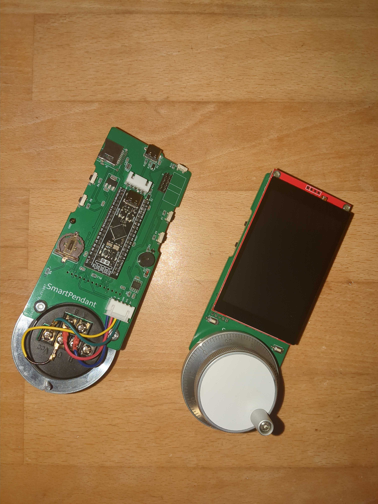
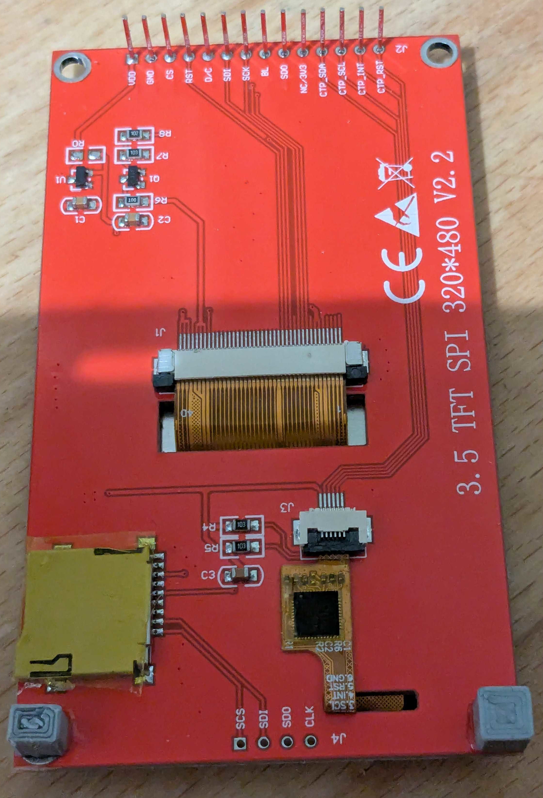

# Devtronic SmartPendant

This project allows controlling a grblHAL based CNC machine without a PC. It also makes work way more convenient.

This fork builds upon the original Devtronic/Nicolai Shlapunov project, which has a store here: https://devtronic.square.site/

I have no intentions to offer this version for sale, but all files are freely available. The changes compared to the original project are:

* Instead of a display with two FCC connectors this version uses a display with a single 2.54 mm pitch connector. This does mean that the pendant is a few millimetres thicker.
* The LEDs have been removed.
* Passives are 0603 instead of 0805.
* Screw terminals have been replaced with JST XH connectors.

# Firmware

Source code for this project can be found here: **https://github.com/bullestock/SmartPendantFirmware**

To load new firmware you can either use OpenOCD, or the [STM32CubeProgrammer](https://www.st.com/en/development-tools/stm32cubeprog.html).

## OpenOCD

For this you need an "ST-Link V2 mini" adapter, which can be obtained for a few dollars from AliExpress and other sites.

Connect the adapter and run this command:

    openocd -f interface/stlink.cfg -f target/stm32f4x.cfg -c "program SmartPendant.elf verify reset exit"

## STM32CubeProgrammer

Connect SmartPendant to PC using USB-C cable. Press and hold BOOT0 button, then short press NRST button, couple seconds later BOOT0 button can be released.
Open STM32CubeProgrammer. In top right corner choose "USB" from drop down list.
If field "Port" in "USB Configuration" show "No DFU detected" click update button near it.
Click "Connect" button - STM32CubeProgrammer should establish connection and show current device memory content.
Click "Open File" in left to corner, select firmware HEX file, then click "Download" button in top left corner.
When flashing is done, close STM32CubeProgrammer and short press NRST button on the Controller to restart it. 

**Note:** if flashing is successful, but firmware isn't work, check STM32CubeProgrammer log. If it says "sector 0000 does not exist" erasing operation wasn't successful and new firmware "merged"(write operation can only flip bits from 1 to 0) with old one. To fix this issue, press "eraser" button in bottom right corner and click "Ok" button in pop up window. After erasing is finished "Device memory" should show only FFFFFFFF. Flash new firmware after that. 

# Parts

To make this project yourself, you will need these essential parts:

* [WeAct BlackPill F411 25M HSE:](https://s.click.aliexpress.com/e/_DC6TlGd)
* [3.5" Display with touchscreen based on ILI9488 LCD controller and FT6236 touch controller](https://www.aliexpress.com/item/1005009339669149.html)
* [60 mm 6 pin 100 PPR handwheel](https://s.click.aliexpress.com/e/_DCFuJHr)
* [SMD connector for display](https://www.aliexpress.com/item/1005005194925318.html) (note that the connector must be aligned with the through holes, and that you need to remove the plastic part of the header on the display; see picture below).
* [Side button switches](https://www.aliexpress.com/item/1005003036287080.html)
* [Front button switches](https://www.aliexpress.com/item/1005007564864690.html)
* [USB C connector](https://www.aliexpress.com/item/1005008913274510.html)
* [Battery holder](https://www.aliexpress.com/item/4000648810345.html)
* [Buzzer](https://www.aliexpress.com/item/32949954569.html)
* The SD card footprint allows for two common sockets to be mounted.
* See the KiCAD files for additional components.

Note the placement of the two display support pieces (glued to the pcb).

## Case

3D_Print folder of this repo contain 3D files (OpenSCAD and STLs) of the case.

I printed the buttons in TPU filament.

## Dimensions

**160** mm x **65** mm x **24** mm (56 mm with handwheel and handle)

## Schematic

See the kicad directory.

## Firmware

Source code can be found [here](https://github.com/bullestock/SmartPendantFirmware)

